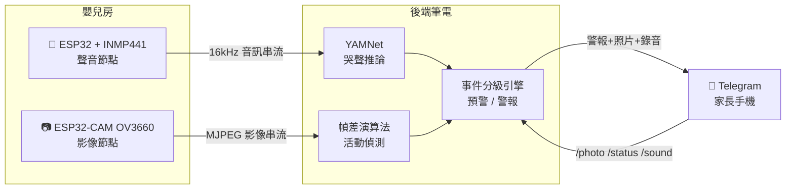

# Baby Monitor — 嬰兒智能監測系統(聲音 + 影像雙模態)

> 用 ESP32 感測節點 + 後端 AI 推論,即時偵測嬰兒哭聲與活動狀態,透過 Telegram 主動通知家長,並附上現場照片與錄音。


---

## 系統能力

- **哭聲警報**:YAMNet 即時辨識哭聲,通知附上現場照片 + 最近 10 秒錄音
- **活動預警**:影像幀差偵測「持續活動」,在寶寶哭出來**之前**提前通知「可能醒了」
- **遠端查看**:Telegram 指令 `/photo` `/status` `/sound` 隨時查看現場
- **定時報平安**:每 15 分鐘回報系統與寶寶狀態
- **節點離線自動通知**:感測節點斷線即刻告警,不會默默失效
- **分級出聲**:預警 → 警報兩級通知,把最終判斷權留給家長的眼睛和耳朵

## 系統架構



**設計原則:感測節點「零智慧」,運算集中在後端。**

| 節點 | 硬體 | 職責 |
|------|------|------|
| 聲音節點 | ESP32 + INMP441(I2S 數位麥克風) | 16kHz 乾淨音訊串流回傳 |
| 影像節點 | ESP32-CAM(OV3660) | MJPEG 影像串流回傳 |
| 後端(筆電) | Python | YAMNet 哭聲推論、幀差活動偵測、事件分級、Telegram 通知 |

**兩條偵測線的分工是刻意的設計決策:**

- **聲音線(主幹)**:哭聲是「需要父母」最可靠的訊號 → 動用深度模型(YAMNet)
- **影像線(輔助)**:「畫面有沒有在動」是簡單問題 → 用透明可控的幀差演算法即可,對棉被遮擋、任何睡姿都穩定。**簡單的問題不需要複雜的工具。**

## 🔧 技術演進:三個世代的撞牆與診斷

這個專案最有價值的部分不是最終架構,而是**為什麼前兩代行不通**。

### 第一代:ESP32 + MAX9814 類比麥克風 + Edge Impulse 自訓模型 ❌

**做法**:餵開源嬰兒哭聲資料集訓練輕量分類模型,燒錄進 ESP32 離線推論。

**結果**:訓練/驗證準確率 99%,**實機上線後幾乎偵測不到任何哭聲**。

**根因診斷**:
1. **Domain shift(資料分佈不一致)**——模型學到的是「哭聲經過開源資料集那條錄音鏈之後的樣子」,不是哭聲本身。換成 MAX9814 這條完全不同的訊號鏈,模型就認不得了
2. **類比訊號鏈層層污染**——AGC 自動增益放大底噪、ESP32 內建 ADC 噪聲大且非線性、迴圈取樣導致取樣率飄移、直流偏壓污染低頻

> 💡 核心教訓:**模型在實驗室的分數,不等於它在真實硬體上的能力。** 沒有實機驗證過的準確率,不算數。

### 第二代:換 INMP441 數位麥克風 + 推論搬到後端 ✅

兩個關鍵改動,各自根治一個問題:

| 改動 | 根治的問題 |
|------|-----------|
| MAX9814 → **INMP441(I2S 數位麥克風)**:聲音在晶片內完成數位化,I2S 直送 ESP32,繞過爛 ADC、無 AGC 干擾、取樣率鎖定 16kHz | 輸入被污染 |
| 自訓小模型 → **Google YAMNet 預訓練模型**(見過兩百萬段音訊,對麥克風差異抗性極強),搭配「分數門檻 + 持續秒數」雙參數 | 小模型泛化差 |

實測成功分辨哭聲,**連寶寶笑聲都不會誤觸發**。

> 💡 核心教訓:ESP32 只做它擅長的事(搬運乾淨資料),不硬扛它不擅長的事(跑模型)。有符合需求的強開源模型,就不要硬自己訓練。

### 第三代:加入影像節點,雙模態分級預警 ✅(目前版本)

新增 ESP32-CAM 影像節點,幀差演算法偵測持續活動 → 在哭聲發生**之前**提前預警,並在每次通知附上現場截圖,實現「預警 → 警報」分級通知。

## 🎚️ 設計亮點:資料驅動的門檻校準

哭聲判定的「分數門檻」不是拍腦袋定的:

1. 系統先以 `LOG_ONLY = True` 模式運行 3~5 天,只記錄不通知
2. 所有分數寫入 `cry_scores.csv`,收集真實環境數據(日常噪音、講話、真哭)
3. 繪製分數分佈,找出哭聲與非哭聲的分離點
4. 把 `CRY_SCORE_THRESHOLD` 設在兩者之間,搭配持續秒數,再切回通知模式

## 🛠️ 技術棧

`Python` `TensorFlow / YAMNet` `ESP32 (Arduino / C++)` `I2S / INMP441` `ESP32-CAM / OV3660` `幀差演算法` `Telegram Bot API` `UDP 音訊串流`

## 🚀 快速開始

完整的硬體接線、韌體燒錄、Telegram Bot 申請與校準流程,請見 **[安裝指南](doc/INSTALL.md)**。

```bash
# 1. 燒錄韌體:Arduino IDE 開啟 esp32_mic_firmware/,填入 WiFi 與筆電 IP
# 2. 設定後端:在 backend/config.py 填入 Telegram Bot Token 與 Chat ID
# 3. 啟動後端
cd backend
pip install -r requirements.txt
python audio_monitor.py
```

第一次執行會自動下載 YAMNet 模型(約 4MB),終端機開始滾動「哭聲 0.xx |####...|」即代表整條管線已通。

## 🗺️ Roadmap

- [x] 聲音哭聲偵測(YAMNet)
- [x] 影像活動預警(幀差)
- [x] Telegram 通知與遠端指令
- [ ] 事件歷史儀表板(睡眠/哭鬧統計)
- [ ] 多房間多節點支援

---

*本專案為個人開發,從硬體選型、訊號鏈診斷到後端架構皆獨立完成。*
